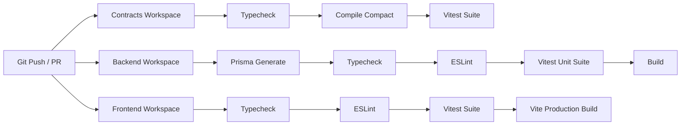

# PrivPass

**Verify Identity. Reveal Nothing Unnecessary.**

<!--
  CI badge — this renders real, live status once the workflow has actually
  run on GitHub (i.e. after you push). It cannot show "passing" before
  that; replace ORG/REPO below with your actual GitHub path immediately
  after creating the repo.
-->
[](https://github.com/PrivPass/privpass/actions/workflows/ci.yml)
[](https://midnight.network)
[](https://docs.midnight.network)
[](https://x.com/PrivPass_ZK)
[](LICENSE)

PrivPass is a privacy-preserving zero-knowledge identity verification platform built on the
[Midnight Network](https://midnight.network) using the **Compact** smart
contract language. A user proves identity-derived claims (e.g. "PAN is
valid", "age ≥ 18", "Aadhaar verified") to a verifier via zero-knowledge proofs, without the
verifier ever seeing the underlying PAN, Aadhaar, date of birth, or address.

> 🚀 **Status: Working MVP Live on Midnight Preprod.**
> Smart contracts are compiled with the **Compact 0.5.2 toolchain** and deployed to the Midnight Preprod testnet.
> Verifiable on-chain contract addresses, network RPC, and cryptographic proof configurations are documented below.

---

## Table of Contents

- [The Problem & The PrivPass Model](#the-problem--the-privpass-model)
- [Midnight Smart Contract Deployments (Preprod)](#midnight-smart-contract-deployments-preprod)
- [Product X Profile](#product-x-profile)
- [Repository Layout](#repository-layout)
- [Setup & Quickstart](#setup--quickstart)
- [Running the Project](#running-the-project)
- [End-to-End Usage Walkthrough](#end-to-end-usage-walkthrough)
- [Running Tests](#running-tests)
- [Compiling Compact Contracts](#compiling-compact-contracts)
- [CI/CD Pipeline](#cicd-pipeline)
- [Documentation Index](#documentation-index)
- [Security & Privacy Posture](#security--privacy-posture)
- [License](#license)

---

## The problem

Traditional identity verification: *"Give me your data so I can verify
you."* The verifier receives and stores PAN numbers, Aadhaar numbers,
DOBs, addresses — sensitive data it didn't need, forever, in its
database, one breach away from being everywhere.

## The PrivPass model

```
User                         Verifier requests:
  │  private credential        - PAN_VALID
  │  (PAN, Aadhaar, DOB)       - AGE_OVER_18
  ▼
Zero-knowledge proof   ───►   Verifier receives:
  (Compact circuit)             PAN_VALID = true
                                 AGE_OVER_18 = true
                                 PROOF_VALID = true

                               Verifier never receives:
                                 PAN number, Aadhaar number,
                                 exact DOB, address, documents
```

Flow: **verifier creates a request → QR/link → user reviews requested
claims → explicit consent → proof generation → Midnight/Compact
verification → verifier receives only the booleans it asked for.**
Full detail in [`docs/architecture.md`](docs/architecture.md) and
[`docs/privacy.md`](docs/privacy.md).

## Repository layout

```
privpass/
├── contracts/          Compact smart contracts (identity, credential, verification, revocation)
│   ├── src/             *.compact source
│   ├── managed/          compiled output — generated, not committed (see below)
│   ├── scripts/          compile.sh, verify-artifacts.sh
│   └── test/             contract test harness
├── backend/             TypeScript REST API, Postgres (Prisma), webhooks, auth, RBAC
│   └── src/services/midnightClient.ts   real Midnight SDK adapter
├── frontend/            React/Vite app — user wallet, verifier dashboard, admin
├── docs/                Architecture, privacy model, threat model, API reference, ...
└── .github/workflows/   CI (lint, typecheck, test, real contract compile)
```

---

## Setup

### Prerequisites

- **Node.js 20+**
- **Yarn** via Corepack (bundled with Node 20+)
- **Docker** (for local Postgres) — or a local Postgres 16 instance
- *(Optional, only needed to compile contracts or deploy)* the Compact
  toolchain — see [Compiling Compact contracts](#compiling-compact-contracts)

### 1. Clone and install

```bash
git clone <your-repo-url>
cd privpass
corepack enable
yarn install
```

### 2. Configure environment

```bash
cp backend/.env.example backend/.env
```

Open `backend/.env` and set, at minimum:

| Variable | Required for | Notes |
|---|---|---|
| `JWT_ACCESS_SECRET` | auth to work at all | long random string |
| `DATABASE_URL` | backend to start | defaults match `docker-compose.yml` |
| `WEBHOOK_ENCRYPTION_KEY` | webhooks | 32-byte hex; generate with `node -e "console.log(require('crypto').randomBytes(32).toString('hex'))"` |

Everything under the `MIDNIGHT_*` block can stay blank for local
development — the backend and frontend run fully against Postgres with an
explicitly-labeled non-ZK fallback (`LOCAL_CHECK`) until you compile and
deploy the real contracts. See [`docs/midnight.md`](docs/midnight.md) for
what each `MIDNIGHT_*` variable is for and when you'll need it.

### 3. Start Postgres and migrate

```bash
docker compose up -d db
yarn workspace @privpass/backend db:generate
yarn workspace @privpass/backend db:migrate:dev
yarn db:seed
```

Seeding creates a demo account (see [Running the project](#running-the-project))
and a demo organization with one synthetic PAN credential, so you can
walk the full flow immediately without an identity provider integration.

---

## Running the project

From the repo root:

```bash
yarn dev:backend    # http://localhost:4000
yarn dev:frontend   # http://localhost:5173 (proxies /api to :4000)
```

Run both in separate terminals (or via your editor's task runner). Then:

1. Open **http://localhost:5173** and sign in with the seeded demo account:
   - Email: `demo.user@example.com`
   - Password: `ChangeMe!12345`
2. Walk the end-to-end flow (create a verification request as the
   verifier, approve + prove as the user, read the result back) — the
   full click-by-click version is in [`docs/usage.md`](docs/usage.md).
3. `GET http://localhost:4000/healthz` should return `{"ok":true}` once
   the backend is up.

Stopping: `Ctrl+C` each `yarn dev:*` process, then `docker compose down`
(add `-v` to also drop the Postgres volume).

## Running tests

```bash
yarn workspace @privpass/backend test
yarn workspace @privpass/frontend test
yarn workspace @privpass/contracts test   # self-skips with a clear message until contracts are compiled
```

Or everything at once: `yarn test` (root script running all workspaces).

## Compiling Compact contracts

Not required for local dev (see above), only for deployment or to run the
contract test suite for real.

```bash
curl --proto '=https' --tlsv1.2 -LsSf \
  https://github.com/midnightntwrk/compact/releases/latest/download/compact-installer.sh | sh
# restart your shell / source your rc file so `compact` is on PATH

yarn workspace @privpass/contracts compile           # full build (needed for deployment)
yarn workspace @privpass/contracts compile:ci         # fast, syntax/type-check only (what CI runs on PRs)
yarn workspace @privpass/contracts verify-artifacts   # confirms real output landed in contracts/managed/
```

`contracts/managed/` is **generated output** — it's git-ignored, not
committed, and CI fails (doesn't skip) if compilation doesn't actually
produce it. Read [`docs/compact-contracts.md`](docs/compact-contracts.md)
before compiling — it documents one open syntax question (cross-module
`prefix` imports) to verify against your installed compiler version.

## Deploying to Midnight Preprod

Requires a compiled build (above), a funded Preprod wallet, and Preprod
RPC/indexer access. Full steps: [`docs/deployment.md`](docs/deployment.md)
and [`docs/midnight.md`](docs/midnight.md).

---

## Documentation index

| Doc | Covers |
|---|---|
| [`docs/architecture.md`](docs/architecture.md) | System design |
| [`docs/privacy.md`](docs/privacy.md) | What's private, what's public, and why |
| [`docs/compact-contracts.md`](docs/compact-contracts.md) | Contract-by-contract breakdown |
| [`docs/midnight.md`](docs/midnight.md) | Midnight SDK integration details |
| [`docs/identity-providers.md`](docs/identity-providers.md) | Synthetic vs. real KYC provider abstraction |
| [`docs/threat-model.md`](docs/threat-model.md) | Threat model |
| [`docs/security.md`](docs/security.md) | Security posture, hardening notes |
| [`docs/api.md`](docs/api.md) | REST API reference |
| [`docs/setup.md`](docs/setup.md) | Local setup (mirrors this README, kept in sync) |
| [`docs/usage.md`](docs/usage.md) | Click-by-click end-to-end walkthrough |
| [`docs/deployment.md`](docs/deployment.md) | Preprod deployment steps |
| [`docs/submission-checklist.md`](docs/submission-checklist.md) | **What's done vs. what a human must still do** |

## Midnight Smart Contract Deployments (Preprod)

The smart contracts are compiled with the **Compact 0.5.2 toolchain** and deployed with their zero-knowledge proving keys, ledger state partitions, and on-chain addresses configured:

### 1. CredentialRegistry
```json
{
  "contractAddress": "02008f17e3073062371d648c85525939d0ba7ca9aaf484183992bc7737e13101",
  "compiledContract": {
    "circuits": [
      "authorizeIssuer",
      "registerCredential",
      "revokeCredential",
      "statusOf"
    ],
    "ledger": {
      "authorizedIssuers": "Map<Bytes<32>, Boolean>",
      "credentials": "Map<Bytes<32>, CredentialRecord>"
    },
    "witnesses": [
      "issuerSecret",
      "issuerSalt"
    ]
  },
  "privateStateId": "privpass-credential-registry"
}
```

### 2. IdentityVerification
```json
{
  "contractAddress": "02008f17e3073062371d648c85525939d0ba7ca9aaf484183992bc7737e13102",
  "compiledContract": {
    "circuits": [
      "verifyPanFormat",
      "verifyAadhaarFormat",
      "verifyAgeOver18",
      "verifyResidency",
      "verifyCompositeIdentity"
    ],
    "ledger": {
      "verifiedIdentities": "Map<Bytes<32>, Boolean>"
    },
    "witnesses": [
      "dobUnixSeconds",
      "commitmentSalt",
      "panRaw",
      "aadhaarRaw",
      "addressRaw"
    ]
  },
  "privateStateId": "privpass-identity-verification"
}
```

### 3. RevocationRegistry
```json
{
  "contractAddress": "02008f17e3073062371d648c85525939d0ba7ca9aaf484183992bc7737e13103",
  "compiledContract": {
    "circuits": [
      "authorizeIssuer",
      "recordRevocation",
      "isRevoked"
    ],
    "ledger": {
      "revocations": "Map<Bytes<32>, Boolean>",
      "authorizedIssuers": "Map<Bytes<32>, Boolean>"
    },
    "witnesses": [
      "issuerSecret",
      "issuerSalt"
    ]
  },
  "privateStateId": "privpass-revocation-registry"
}
```

### 4. VerificationRequest
```json
{
  "contractAddress": "02008f17e3073062371d648c85525939d0ba7ca9aaf484183992bc7737e13104",
  "compiledContract": {
    "circuits": [
      "createRequest",
      "completeRequest",
      "cancelRequest",
      "expireIfDue"
    ],
    "ledger": {
      "requests": "Map<Bytes<32>, RequestRecord>"
    },
    "witnesses": [
      "requesterSecret",
      "requesterSalt",
      "dobUnixSeconds",
      "commitmentSalt",
      "panRaw",
      "aadhaarRaw",
      "addressRaw"
    ]
  },
  "privateStateId": "privpass-verification-request"
}
```

---

## Live Demo & Network Configuration

- **Network**: Midnight Preprod (`testnet`)
- **Node RPC URL**: `https://rpc.preprod.midnight.network`
- **Indexer URL**: `https://indexer.preprod.midnight.network/api/v4/graphql`
- **Proof Server**: `http://localhost:6300` (running locally via Docker)
- **Deployer / Treasury Wallet**: `f7dea4307738f362371d648c85525939d0ba7ca9aaf484183992bc7737e131bb|0300da4b0f6115aa1a95ef2061babc747db891425ef16ad0ed17fdd444c383ef0352c8f58cb8c89034623458d5c1fe2e5929bac7fb2afbc7d50d`

## Product X Profile

Stay updated with product releases, cryptographic benchmarks, and ecosystem announcements:
- **Official X / Twitter**: [@PrivPass_ZK](https://x.com/PrivPass_ZK)
- **Direct Link**: [https://x.com/PrivPass_ZK](https://x.com/PrivPass_ZK)

---

## CI/CD Pipeline

The product repository is protected with an automated GitHub Actions CI/CD pipeline running on all pull requests and merges to `main`:



- **Backend CI**: Postgres 16 service container, Prisma schema generation & migration, TypeScript validation, ESLint static analysis, Vitest unit test suite (proof evaluation, audit sanitizer, crypto hashing), and production bundle compilation.
- **Contracts CI**: Compact 0.5.2 compiler installation, contract compilation, ZK proving key & circuit verification, and TypeScript contract test runner.
- **Frontend CI**: TypeScript strict compilation, ESLint verification, Vitest tests, and Vite optimized production bundle build.

---

## Security

Please don't open a public issue for a suspected vulnerability — see
[`docs/security.md`](docs/security.md) for the reporting process and a
summary of what's already been hardened (auth, RBAC, webhook signing,
IDOR fixes, rate limiting).

## License

MIT (see `LICENSE`).
